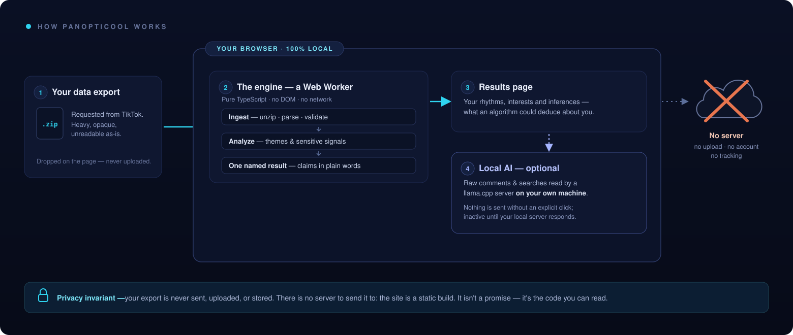
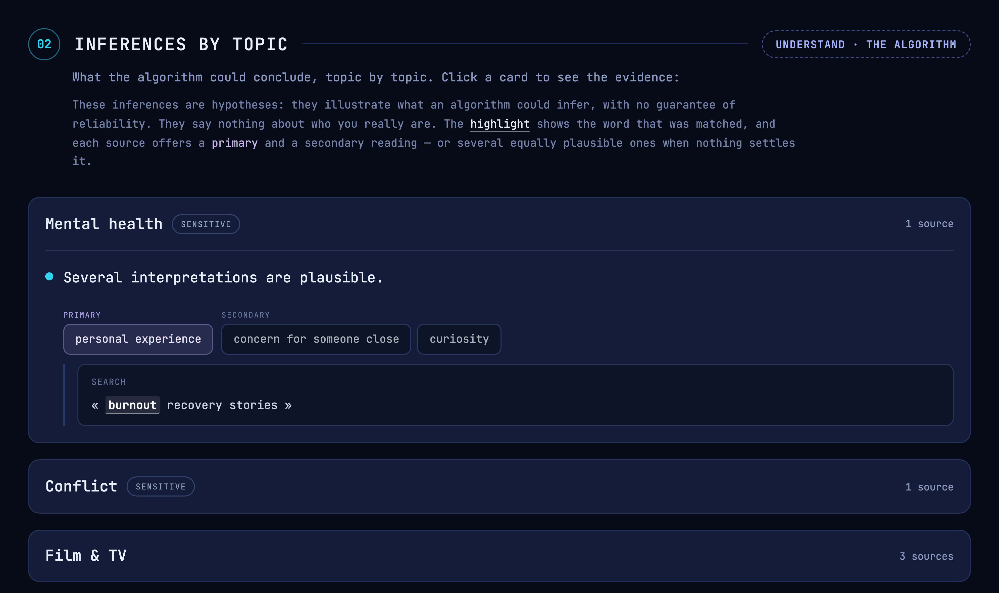

<div align="center">


# PanoptiCool

**Your data exports, decoded on your own machine.**

[**panopti.cool**](https://panopti.cool) · 100 % local · no account · [AGPL-3.0](LICENSE) · French & English

[](https://github.com/lagayayuya/PanoptiCool/actions/workflows/ci.yml)

</div>

Every platform has to hand over your data if you ask for it. What it sends back is a bulky,
unreadable archive. PanoptiCool reads it and lets you browse your own data,
while explaining what an algorithm could deduce from it: your rhythms, your interests, and all the
other things you don't think you're leaving behind.

The experience isn't a comfortable one — it works as a kind of digital mirror, and it's worth
keeping some distance while using it. The goal is not to hand down a cold verdict on who you are,
but to come face to face with what we give away, and with what can be done with it.

> [!IMPORTANT]
> **Everything happens in your browser.** Your export is never sent, uploaded, or stored. There is
> no server to send it to: the site is a static build, and the analysis runs in a Web Worker on your
> machine. This isn't promised, it's verifiable.



**Today, a single connector: TikTok.** Instagram is in progress — its export is far richer, which
calls for a different reading: a map of locations, an analysis of conversations. 

→ **[The roadmap](https://panopti.cool/en/feuille-de-route/)** — what's done, what's in progress,
and what comes next.

---

## Try it

Everything below happens on **[panopti.cool](https://panopti.cool)**. Nothing to install, no
account, no key.

**Without an export — [run the demo](https://panopti.cool/en/analyse/?demo).** A **synthetic
persona**, invented from scratch, run through the real engine. It's the shortest way to see what the
product does. You can also drop [`samples/user_data_tiktok.sample.zip`](samples/), a fake export
shipped with this repo.

**With your own export.** Ask TikTok for your data — Profile → Settings → Account → Download your
data, **JSON** format; the file takes 1 h to 48 h to arrive. Then drop the `.zip` on
[the analysis page](https://panopti.cool/en/analyse/).

### Going further: a local AI — optional

The results page ends on one last step: having a language model read your **raw** comments and
searches. The model is [`llama.cpp`](https://github.com/ggml-org/llama.cpp) and it runs **on your
own machine** — free, offline, nothing sent anywhere.

You don't need this repo for it. [The page](https://panopti.cool/en/analyse/) walks you through it,
detects your OS, and gives you the exact commands to copy — including the shortest path, where a
single `llama-server` serves **both the site and the model** from your device, so it works in any
browser and even without an Internet connection afterwards. The commands live there rather than
here so the two can't drift apart.

The invariant holds in that mode too: the only network recipient is a server running on your own
machine, and nothing leaves without an explicit click. (Depending on your browser, reaching that
local server may need a permission — the page tells you, and the reasoning is in
[ADR-0006](docs/adr/0006-acces-au-serveur-local-depuis-un-site-https.md).)

---

## What it shows



<div align="center"><sub>The demo persona — every value on this screen is synthetic.</sub></div>

Three things are visible in that one card, and they are the product:

- **Every deduction is tied to the exact crumb that produced it** — the matched word, highlighted,
  inside the comment or search it came from. No claim without its evidence.
- **A reading is offered, not imposed.** One primary interpretation, the plausible alternatives next
  to it, and a confidence level that stays capped when the evidence is thin.
- **Sensitive subjects are framed as what a platform _could_ infer** — systemic, never a personal
  verdict. That doctrine is the reason this project exists; it is written down in
  [ADR-0003](docs/adr/0003-doctrine-constats-sensibles.md) and kept as a living catalog in
  [`docs/constats-sensibles.md`](docs/constats-sensibles.md).

---

## How it's built

An **Astro** shell as a static build, interactivity in **Preact** islands, and a **pure TypeScript**
engine running in a **Web Worker**. The interface and the detection both exist in **French and
English**.

The engine (`web/src/engine/`) is the serious piece, and it's kept at arm's length from the
interface by two guardrails checked on every CI run:

- its own `tsconfig.json`, **without `lib: DOM`** — `document` and `window` don't typecheck there;
- a Biome `noRestrictedImports` rule that forbids it from importing Preact or Astro.

Three ideas make the product, and they explain the code better than its directory tree does:

- **The semantic wall.** Only a small share of an export's volume is self-describing offline: video
  links are opaque. The profile is reconstructed from **searches, comments and followed accounts**,
  not from links. But that is also the strongest argument the tool makes: by interpreting only a few
  percent of the export (generally between 0 and 5 %), PanoptiCool already surfaces a great deal —
  and this first version doesn't exploit the full potential of a TikTok export.
- **Education.** Raising awareness about data protection also runs through understanding the data
  itself. PanoptiCool means to be, in parallel, a tool for exploring your data and for clearly
  understanding how it's used and how platforms' tools work. That's part of what the local AI step
  is for: seeing how easily certain inferences are made, and learning along the way how an LLM
  actually behaves.
- **Accessibility.** One of this project's main stakes, and probably its most complex: reaching as
  many people as possible — through open source, but above all through design centered on the
  experience. It aims to be captivating, easy to approach and non-blocking, without sacrificing the
  tool's relevance.

### Where to look

| Path | What it is |
|---|---|
| `web/src/engine/` | the engine — pure TS, no DOM, runs in a Worker |
| `web/src/engine/detect/` + `lexicon/` | the core: detection of themes and sensitive signals, and the filters that keep it from over-asserting |
| `web/src/engine/detect/*-bench.test.ts` | the sealed-voices benches — the ground truth written before the measurement, and the sensors that go red |
| `web/src/engine/wording.fr.ts` / `.en.ts` | what the machine dares to deduce — one prose file per language, readable in one sitting |
| `web/src/ui/copy.fr.ts` / `.en.ts` | what the interface says — the second ratifiable perimeter, same rule |
| `web/src/ui/` | the interface (Preact islands) |
| `web/src/demo/` | the synthetic persona of demo mode |
| `docs/adr/` | the structuring decisions and their reasons |
| `docs/tiktok-export-schema.md` | the structure contract of a TikTok export — reverse-engineered, the only source of truth on the format |
| `docs/methode-portabilite-en.md` | what the move to English taught — the method note |
| `panopticool/` | the fake-export generator (Python) — [its own README](panopticool/README.md) |
| `samples/` | ready-to-use fake exports |

### The decisions, and why

They are dated and frozen in [`docs/adr/`](docs/adr/) — one ADR per decision, with what it cost and
what was set aside:

- [ADR-0001](docs/adr/0001-hebergement-souverain-sans-backend.md) — sovereign hosting, no backend.
- [ADR-0002](docs/adr/0002-traitement-dans-le-navigateur.md) — processing lives in the browser.
- [ADR-0003](docs/adr/0003-doctrine-constats-sensibles.md) — **what the tool dares to assert, and what it refuses to assert.** This is the one that carries the reason for being.
- [ADR-0004](docs/adr/0004-moteur-une-valeur-nommee.md) — the engine returns a named value.
- [ADR-0005](docs/adr/0005-licence-agpl-v3.md) — the move to AGPL v3.
- [ADR-0006](docs/adr/0006-acces-au-serveur-local-depuis-un-site-https.md) — access to the local server from an HTTPS site.

A choice too small for an ADR is recorded **inline**, in the comment that carries the constraint.

---

## Privacy — the repo's invariant

**No real export is here, and none will ever enter.** Every value produced by the generator is
invented. That's the reason the fixture exists, and the rule is non-negotiable — including in the
tests.

Development, for its part, sometimes looks at a real export — the maintainer's own, or that of a
person who gives explicit consent — to diagnose or calibrate. It stays on that machine, outside the
repo. What is allowed to cross the border is a **structure** or a **statistic**: the
[structure contract](docs/tiktok-export-schema.md) is the example, reverse-engineered from a real
export with all its values removed. Never a value. An export also contains messages from people who
asked for nothing: it's that border that protects them, not our ignorance.

---

## Running it from source

You only need this if you want to modify the site. To *use* it, [panopti.cool](https://panopti.cool)
and the local-AI mode above need nothing installed.

**Node 22** (the version CI runs on; Vitest 4 rules out Node 23). If you don't have it,
[**nvm**](https://github.com/nvm-sh/nvm) lets several versions coexist:

```sh
nvm install 22 && nvm use 22
```

```sh
git clone https://github.com/lagayayuya/PanoptiCool.git
cd PanoptiCool/web
npm install
npm run dev
```

Open **<http://localhost:8080>**. No key, no account. Demo mode is at
`/en/analyse?demo` (or `/fr/analyse?demo`).

| Command (from `web/`) | What it does |
|---|---|
| `npm run dev` | development server (port 4321) |
| `npm run build` | static build in `web/dist/` — both languages, plus the site archive |
| `npm run test` | the Vitest suite |
| `npm run typecheck` | `astro check` + the engine's TS pass |
| `npm run lint` | Biome |

What CI requires — all four must pass from `web/`, plus the generator smoke from the root:

```sh
npm run lint && npm run typecheck && npm run test && npm run build
```

```sh
python -m panopticool -o /tmp/ci.zip && python -m panopticool.validate /tmp/ci.zip
```

### The fixture generator

The fake exports this product is tested against come from a small Python generator — **stdlib only,
zero dependencies**. It produces a `.zip` whose values are **100 % synthetic** but whose structure is
identical to a real export, and it validates the result against the
[structure contract](docs/tiktok-export-schema.md).

It also builds **adversarial** entries — an emptied section, an omitted key — so that "absence as a
signal" is tested rather than merely asserted.

→ **[`panopticool/README.md`](panopticool/README.md)** — personas, volumes, adversarial flags, and
how to reproduce the archives in [`samples/`](samples/) bit for bit.

---

## License

[AGPL-3.0-only](LICENSE) — see also [`NOTICE`](NOTICE). The reasoning (and why this repo left MIT) is
in [ADR-0005](docs/adr/0005-licence-agpl-v3.md).

## Contributing

**Where a hand would help is listed on the [roadmap](https://panopti.cool/en/feuille-de-route/)**,
and the first item needs no technical skill: enriching the analysis lexicons, in French as much as
in English — a word, a turn of phrase, a colloquial variant. The second is to dig through your own
export and say what could still be drawn from it (the TikTok analysis was calibrated on one account
where whole sections were empty). **Don't send your export**, only what you found in it; that
border is the repo's invariant, above.

[`CLAUDE.md`](CLAUDE.md) holds the repo's conventions and invariants — it addresses AI agents, but it
describes the same rules for everyone. [`METHODE.md`](METHODE.md) describes the working method, and
[`AI_USAGE.md`](AI_USAGE.md) logs the collaboration with AI, ratified by hand.
