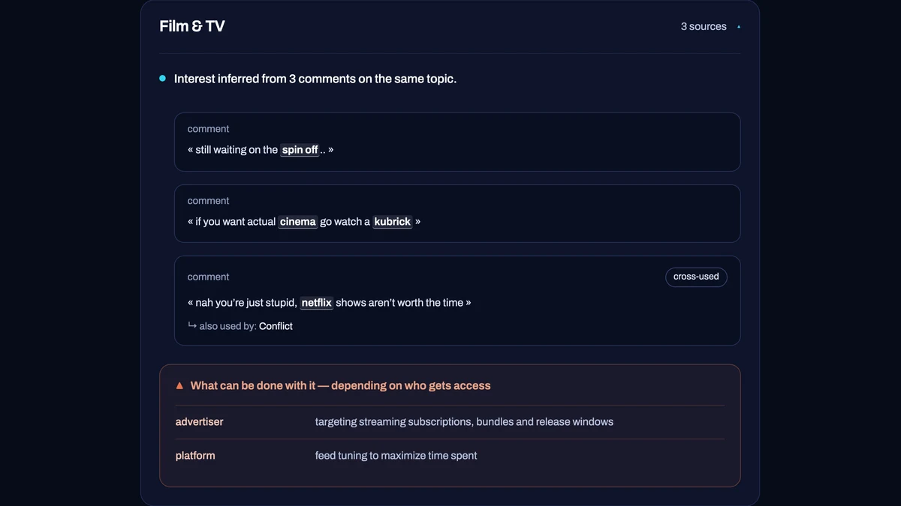

<div align="center">


# PanoptiCool

**Your data exports, decoded on your own machine.**

[**panopti.cool**](https://panopti.cool) · 100 % local · no account · [AGPL-3.0](LICENSE) · French & English

[](https://github.com/lagayayuya/PanoptiCool/actions/workflows/ci.yml)

</div>

Every platform has to hand over your data if you ask for it. What it sends back is a bulky,
unreadable archive. PanoptiCool reads it and lets you browse your own data,
while explaining what an algorithm could deduce from it: your rhythms, your interests, and all the
other things you don't think you're leaving behind.

The experience isn't a comfortable one — it works as a kind of digital mirror, and it's worth
keeping some distance while using it. The goal is not to hand down a cold verdict on who you are,
but to come face to face with what we give away, and with what can be done with it.

<table>
<tr>
<td width="50%"></td>
<td width="50%"></td>
</tr>
<tr>
<td align="center"><sub><b>Instagram</b> — the accounts you cross, as a crowd</sub></td>
<td align="center"><sub><b>TikTok</b> — an inference, with the crumbs that produced it</sub></td>
</tr>
</table>

<div align="center"><sub>Both screens come from the <b>synthetic personas</b> — every value on them is invented.</sub></div>

> [!IMPORTANT]
> **Everything happens in your browser.** Your export is never sent, uploaded, or stored. There is
> no server to send it to: the site is a static build, and the analysis runs in a Web Worker on your
> machine. This isn't promised, it's verifiable.

## Two exports, two readings

They are not two versions of the same page. The formats have nothing in common, and neither do the
products drawn from them.

**[Instagram](https://panopti.cool/en/instagram/)** — a dossier in six pieces. Your identity as the
platform reassembled it (what you declared, and what it guessed), a map of the places your addresses
gave away, ten years of conversations in volumes and rhythms, the accounts you cross as a crowd you
can walk into, every photo, video and voice note the export carries, and an optional reading of one
conversation by a language model running on your own machine.

**[TikTok](https://panopti.cool/en/tiktok/)** — an analysis in four sections. Your activity rhythm,
what could be inferred about you theme by theme with the exact crumb behind each claim, a summary of
where such a profile travels, and the same optional local-AI step on your comments and searches.

More are on the [roadmap](https://panopti.cool/en/feuille-de-route/) — what's done, what's in
progress, and what comes next.

---

## Try it

Everything below happens on **[panopti.cool](https://panopti.cool)**. Nothing to install, no
account, no key.

**Without an export — run a demo.** A **synthetic persona**, invented from scratch, run through
the real engine: [Instagram](https://panopti.cool/en/instagram/?demo) or
[TikTok](https://panopti.cool/en/tiktok/?demo). It's the shortest way to see what the product does.
For TikTok you can also drop [`samples/user_data_tiktok.sample.zip`](samples/), a fake export
shipped with this repo.

**With your own export.** Both platforms have to give you one, and neither makes it obvious: the
menu is buried, JSON is not the default format, and Instagram hands over a single year unless you
ask for all of it. The home page walks you through it screen by screen, for either platform, and
offers a calendar reminder — the file takes hours to days to arrive. Then drop the `.zip` on the
matching page.

### Going further: a local AI — optional

Both analyses end on the same optional step: having a language model read part of your export —
your **raw** comments and searches on the TikTok side, the content of **one conversation you pick**
on the Instagram side. The model is [`llama.cpp`](https://github.com/ggml-org/llama.cpp) and it runs
**on your own machine** — free, offline, nothing sent anywhere. What that means for your messages,
and the rule that governs it, is [ADR-0008](docs/adr/0008-lecture-du-contenu-des-messages.md).

You don't need this repo for it. The page walks you through it,
detects your OS, and gives you the exact commands to copy — including the shortest path, where a
single `llama-server` serves **both the site and the model** from your device, so it works in any
browser and even without an Internet connection afterwards. The commands live there rather than
here so the two can't drift apart.

The invariant holds in that mode too: the only network recipient is a server running on your own
machine, and nothing leaves without an explicit click. (Depending on your browser, reaching that
local server may need a permission — the page tells you, and the reasoning is in
[ADR-0006](docs/adr/0006-acces-au-serveur-local-depuis-un-site-https.md).)

---

## What it shows


<div align="center"><sub>The demo persona — every value on this screen is synthetic.</sub></div>

That card belongs to the TikTok analysis, and the two previews at the top of this page show what
each product looks like. Three things are visible in this one, and they are the doctrine both
connectors are built on:

- **Every deduction is tied to the exact crumb that produced it** — the matched word, highlighted,
  inside the comment or search it came from. No claim without its evidence.
- **A reading is offered, not imposed.** One primary interpretation, the plausible alternatives next
  to it, and a confidence level that stays capped when the evidence is thin.
- **Sensitive subjects are framed as what a platform _could_ infer** — systemic, never a personal
  verdict. That doctrine is the reason this project exists; it is written down in
  [ADR-0003](docs/adr/0003-doctrine-constats-sensibles.md) and kept as a living catalog in
  [`docs/constats-sensibles.md`](docs/constats-sensibles.md).

---

## How it's built

An **Astro** shell as a static build, interactivity in **Preact** islands, and a **pure TypeScript**
engine running in a **Web Worker**. The interface and the detection both exist in **French and
English**.

The engine (`web/src/engine/`) is the serious piece, and it's kept at arm's length from the
interface by two guardrails checked on every CI run:

- its own `tsconfig.json`, **without `lib: DOM`** — `document` and `window` don't typecheck there;
- a Biome `noRestrictedImports` rule that forbids it from importing Preact or Astro.

Three ideas make the product, and they explain the code better than its directory tree does:

- **The semantic wall, and its opposite.** In a TikTok export, only a small share of the volume is
  self-describing offline: video links are opaque, so the profile is reconstructed from **searches,
  comments and followed accounts**. That is also the strongest argument the tool makes — by
  interpreting a few percent of the archive (generally 0 to 5 %), it already surfaces a great deal.
  An Instagram export poses the reverse problem: nearly everything is readable, gigabytes of it, and
  the difficulty moves from *inferring* to *choosing what not to show*. The two connectors answer to
  the same doctrine and share an engine seam; they do not share a report
  ([ADR-0007](docs/adr/0007-le-joint-de-plateforme.md)).
- **Education.** Raising awareness about data protection also runs through understanding the data
  itself. PanoptiCool means to be, in parallel, a tool for exploring your data and for clearly
  understanding how it's used and how platforms' tools work. That's part of what the local AI step
  is for: seeing how easily certain inferences are made, and learning along the way how an LLM
  actually behaves.
- **Accessibility.** One of this project's main stakes, and probably its most complex: reaching as
  many people as possible — through open source, but above all through design centered on the
  experience. It aims to be captivating, easy to approach and non-blocking, without sacrificing the
  tool's relevance.

### Where to look

| Path | What it is |
|---|---|
| `web/src/engine/` | the engine — pure TS, no DOM, runs in a Worker |
| `web/src/engine/instagram/` | the Instagram connector — the archive read entry by entry, and its six reports |
| `web/src/engine/detect/` + `lexicon/` | the core: detection of themes and sensitive signals, and the filters that keep it from over-asserting |
| `web/src/engine/detect/*-bench.test.ts` | the sealed-voices benches — the ground truth written before the measurement, and the sensors that go red |
| `web/src/engine/wording.fr.ts` / `.en.ts` | what the machine dares to deduce — one prose file per language, readable in one sitting |
| `web/src/ui/copy.fr.ts` / `.en.ts` | what the interface says — the second ratifiable perimeter, same rule |
| `web/src/ui/` | the interface (Preact islands) |
| `web/src/ui/instagram/` | the six pieces of the Instagram dossier — the one place the product uses CSS files, and why |
| `web/src/ui/copy.instagram.fr.ts` / `.en.ts` | what the Instagram interface says — the fourth ratifiable perimeter |
| `web/src/demo/` | the synthetic persona of demo mode |
| `docs/adr/` | the structuring decisions and their reasons |
| `docs/instagram-export-schema.md` | the structure contract of an Instagram export — reverse-engineered, the only source of truth on the format |
| `docs/tiktok-export-schema.md` | the same, for TikTok |
| `docs/methode-portabilite-en.md` | what the move to English taught — the method note |
| `panopticool/` | the fake-export generator (Python) — [its own README](panopticool/README.md) |
| `samples/` | ready-to-use fake exports |

### The decisions, and why

They are dated and frozen in [`docs/adr/`](docs/adr/) — one ADR per decision, with what it cost and
what was set aside:

- [ADR-0001](docs/adr/0001-hebergement-souverain-sans-backend.md) — sovereign hosting, no backend.
- [ADR-0002](docs/adr/0002-traitement-dans-le-navigateur.md) — processing lives in the browser.
- [ADR-0003](docs/adr/0003-doctrine-constats-sensibles.md) — **what the tool dares to assert, and what it refuses to assert.** This is the one that carries the reason for being.
- [ADR-0004](docs/adr/0004-moteur-une-valeur-nommee.md) — the engine returns a named value.
- [ADR-0005](docs/adr/0005-licence-agpl-v3.md) — the move to AGPL v3.
- [ADR-0006](docs/adr/0006-acces-au-serveur-local-depuis-un-site-https.md) — access to the local server from an HTTPS site.
- [ADR-0007](docs/adr/0007-le-joint-de-plateforme.md) — **the platform seam: what two connectors share, and what they must not.**
- [ADR-0008](docs/adr/0008-lecture-du-contenu-des-messages.md) — **reading the content of messages: on demand, in memory, on a gesture.**

A choice too small for an ADR is recorded **inline**, in the comment that carries the constraint.

---

## Privacy — the repo's invariant

**No real export is here, and none will ever enter.** Every value produced by the generator is
invented. That's the reason the fixture exists, and the rule is non-negotiable — including in the
tests.

Development, for its part, sometimes looks at a real export — the maintainer's own, or that of a
person who gives explicit consent — to diagnose or calibrate. It stays on that machine, outside the
repo. What is allowed to cross the border is a **structure** or a **statistic**: the two
[structure](docs/instagram-export-schema.md) [contracts](docs/tiktok-export-schema.md) are the
example, reverse-engineered from real exports with all their values removed. Never a value.

That border matters more since the Instagram connector, because an Instagram export contains
**messages from people who asked for nothing** — and the product can now show them to you. It reads
them only on your gesture, only in memory, and never keeps them; the rule and its enforcement are in
[ADR-0008](docs/adr/0008-lecture-du-contenu-des-messages.md). It's that border that protects those
people, not our ignorance — which is also why every screen in this README and in the docs comes from
a synthetic persona.

---

## Running it from source

You only need this if you want to modify the site. To *use* it, [panopti.cool](https://panopti.cool)
and the local-AI mode above need nothing installed.

**Node 22** (the version CI runs on; Vitest 4 rules out Node 23). If you don't have it,
[**nvm**](https://github.com/nvm-sh/nvm) lets several versions coexist:

```sh
nvm install 22 && nvm use 22
```

```sh
git clone https://github.com/lagayayuya/PanoptiCool.git
cd PanoptiCool/web
npm install
npm run dev
```

Open **<http://localhost:8080>**. No key, no account. Demo mode is at `/en/instagram?demo` or
`/en/tiktok?demo` (and the same under `/fr`).

⚠ **The map's geo database is not in this repo** (128 MB, gitignored). Without it the map still
draws the real GPS points and says, in the interface, that the layer inferred from your addresses is
missing. `node scripts/fetch-geo-db.mjs` fetches it.

| Command (from `web/`) | What it does |
|---|---|
| `npm run dev` | development server (port 8080 — the same port route B serves the site on) |
| `npm run build` | static build in `web/dist/` — both languages, plus the site archive |
| `npm run test` | the Vitest suite |
| `npm run typecheck` | `astro check` + the engine's TS pass |
| `npm run lint` | Biome |

What CI requires — all four must pass from `web/`, plus the generator smoke from the root:

```sh
npm run lint && npm run typecheck && npm run test && npm run build
```

```sh
python -m panopticool -o /tmp/ci.zip && python -m panopticool.validate /tmp/ci.zip
```

### The fixture generator

The fake exports this product is tested against come from a small Python generator — **stdlib only,
zero dependencies**. It produces a `.zip` whose values are **100 % synthetic** but whose structure is
identical to a real export, and it validates the result against the
[structure contract](docs/tiktok-export-schema.md).

It also builds **adversarial** entries — an emptied section, an omitted key — so that "absence as a
signal" is tested rather than merely asserted.

→ **[`panopticool/README.md`](panopticool/README.md)** — personas, volumes, adversarial flags, and
how to reproduce the archives in [`samples/`](samples/) bit for bit.

---

## License

[AGPL-3.0-only](LICENSE) — see also [`NOTICE`](NOTICE). The reasoning (and why this repo left MIT) is
in [ADR-0005](docs/adr/0005-licence-agpl-v3.md).

## Contributing

**Where a hand would help is listed on the [roadmap](https://panopti.cool/en/feuille-de-route/)**,
and the first item needs no technical skill: enriching the analysis lexicons, in French as much as
in English — a word, a turn of phrase, a colloquial variant. The second is to dig through your own
export and say what could still be drawn from it — each connector was calibrated on a single
account, and on that account whole sections were empty. **Don't send your export**, only what you
found in it; that border is the repo's invariant, above.

[`CLAUDE.md`](CLAUDE.md) holds the repo's conventions and invariants — it addresses AI agents, but it
describes the same rules for everyone. [`METHODE.md`](METHODE.md) describes the working method, and
[`AI_USAGE.md`](AI_USAGE.md) logs the collaboration with AI, ratified by hand.
